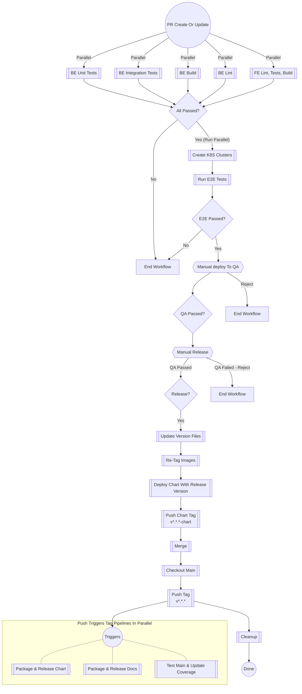

# Contributing

Developers are expected to write and test their code on their local environments and in some cases remote environments
when available.

You should only open a Pull Request when one of the below requirements are met:

* You have been asked to provide a preview or demo of your work, in which case you should create a `draft` pr
* You have tested your code locally and are confident your work is ready for peer review and QA

## Project structure

* `cmd`: Application roots
    * `app`: This is the entry point for the backend
    * `web`: This is the front end project
    * `e2e`: E2E tests for the frontend live here
* `internal`: Backend code that you should not be able to install using `go get` goes here
* `pkg`: Api Client or other code that you should be able to `go get` in another project goes here
* `test`:
    * `e2e`: E2E tests all live here, you can create sub packages
        - *Note*: that all tests in this package should not use mocks, they will run against a live environment
  - `perf`: Performance tests go in here
    - *Note*: tests in here can be run both against code and against the live e2e environment
  - `integration`: optional and should contain tests that cover cases where e2e testing or unit testing can not cover an usecase
* `deployment`: Charts and other configuration to do with deployments live here
* `docs`: Markdown documentation goes here, this package will be built and deployed whenever pr is released

## Testing

When you create a PR several jobs will begin running:

* Unit Tests: Jobs will start up and run your unit tests against multiple cpu architectures
  - Only tests contained inside `pkg` and `internal` packages will be included at this stage
    * Front end unit tests are run during the build stage of the frontend
    * Unit test files should live alongside the code they are testing and the files should end with `_test`
* Integration Tests: Jobs will start up and run your unit tests against multiple cpu architectures
  - Only tests in the `test/integration` package will be included at this stage
* E2E Tests: Jobs will start up that each spin up a different version of kubernetes
  - Each supported kubernetes version will be spun up using kiNd
    * The stack and any supporting test samples will be deployed to each cluster using their charts
    * Only tests in the `test/e2e` package will be included at this stage
    * The stacks are destroyed after all the tests have run
    * Logs and debugging information are captured as artifacts on the build and can be downloaded
  - The front end e2e tests will be started after the backend e2e tests have run successfully

## Process Overview

!!! note

    When a pull request reaches it's release stage 2 tags will be generated.

    - v\*.\*.\*: A tag created from main after the pr has been merged, it does not contain verision number changes.
        - eg. v1.0.0
    - v\*.\*.\*-chart: This version contains the commit history and the updated version numbers in the chart files
        - eg. v1.0.0-chart

