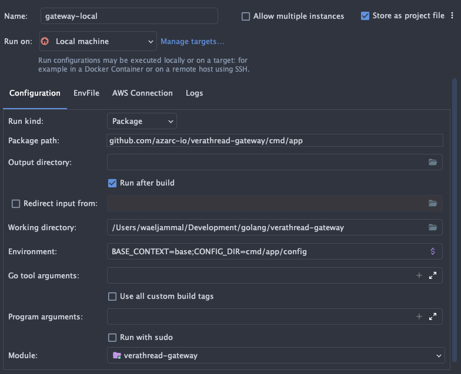
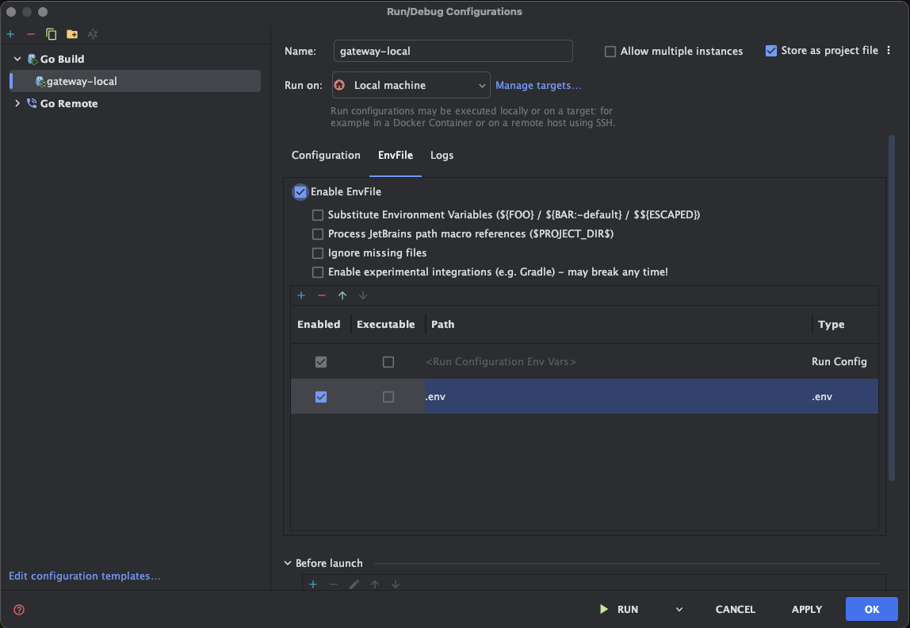

# Local Development

There are 2 ways you can develop without needing kubernetes 
but first make sure you meet the requirements and prerequisites below.

### Requirements

* Node 20+
* Go 1.22+
- [Docker](https://www.docker.com/get-started/)
- [Docker Compose](https://docs.docker.com/compose/install/)
* Installed tools from the [Getting Started](gs_setup.md) step

### Prerequisites

To bring up Mongo, Nats and Redis run the following command
```shell
task compose
```
in the root of the project to bring up any dependencies before using either of the options below.

### Option 1

The first is to simply start the front end using `yarn dev` and create a run configuration in your IDE.

Your run configuration should have the following Environment Variables set:

```shell
BASE_CONTEXT=base;CONFIG_DIR=cmd/app/config
```



You should also point your run config to your `.env` file so that secret values are provided to the runtime.



To start the front end cd into `cmd/web` and run `yarn dev`.

!!! info
    
    If you want to proxy the shell through the gateway then you can run `yarn build:watch` instead and navigate
    to `http://127.0.0.1:6010`

### Option 2

You can run `task dev` which will start the backend with hot reloading enabled and the front end with hmr enabled.

```shell
task dev
```

!!! info 

    If you preferred to start each independently you can instead run:
    
    ```shell
    task dev:be
    task dev:fe
    ```

