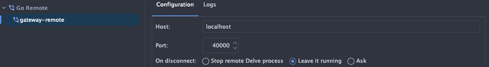

# Develop Using Tilt

A pre-requisite for developing with Tilt in Kubernetes is to check out and follow the steps outlined in the
[Verathread Developer Toolkit](https://dev-toolkit-docs.cloud.azarc.dev/gs_setup/) documentation, you can find the
repository [here](https://github.com/azarc-io/verathread-dev-toolkit).

Once you have completed those steps then you can proceed with the below steps.

You can clone the toolkit using this command:
```shell
git clone git@github.com:azarc-io/verathread-dev-toolkit.git
```

### Tilt

Tilt is a tool that makes it easy to develop on a kubernetes environment with the following benefits:

- Iterate on charts with hot reloading
- Backend and Frontend live reloading
- Debug code from your ide
- Work in an environment that simulates where your software will be running in production
- Easily monitor all your logs and perform custom actions from a ui such as resetting your database

You can read the Tilt documentation [here](https://tilt.dev/)

!!! warning

    Before proceeding please make sure you have completed the pre-requisite step as outlined at the top
    of this document.

#### Setting which kubernetes context to use

By default, the context is set to `k3d-dev-1` in the `tilt_config.json` file, this is the correct value when using
the [Verathread Developer Toolkit](https://dev-toolkit-docs.cloud.azarc.dev/gs_setup/) 
however it can be changed if you are running your own kubernetes cluster.

#### Switching between HMR and Production mode for Frontend

By default, HMR is enabled when you run `tilt up` if you would like to get a better feel for your bundle sizes
you can edit the `tilt_config.json` file in the root of the project and set `hmr` to false. This will require you
to click on the little refresh icon in the tilt dashboard to do a full reload, now when you edit your front end you
will have to manually refresh your page but your bundles will be smaller.

!!! tip

    If switching does not work after updating the `tilt_config.json` file while tilt is running you can click on the reload icon in
    the tilt dashboard to re-deploy the chart and it should then work. This might take a minuite or two to complete due to the lager
    initial docker image push required.

    Running in HMR more produces a larger docker image, but once it's pushed updates happen quickly.

#### Setting the correct `GOARCH` for your system

By default, Tilt is building for `arm64` however you can easily change this by editing the `tilt_config.json` in
the root of the project.

* If you are running an Arm cpu
```json
{
  "arch": "arm64"
}
```
* If you are running an X86 cpu
```json
{
  "arch": "amd64"
}
```

#### Debugging the Backend

[Delve](https://github.com/go-delve/delve) is the debugger that is used when you debug in your ide,
we use the same delve binary within the docker images during development and expose a debug port
that you can connect to from your IDE in order to debug your code while it runs inside Kubernetes.

This consumes extra memory and cpu and is turned off by default, in order to enable debugging you can edit the
`tilt_config.json` file in the root of the project and add the name of the service to the `debug` list.

```json
{
  "to-debug": [
    "gateway"
  ]
}
```
!!! tip

    If debugging does not work after updating this file while tilt is running you can click on the reload icon in
    the tilt dashboard to re-deploy the chart and it should then work.

All services expose their debug port on `40000` but are mapped to different local ports. The gateway is mapped to port
`40000` locally.

!!! info

    You can change the debug port if it clashes with another project by chaging the relevant port value in the 
    `tilt_config.json`

    ```json
        {
            "gateway-debug-port": "40000",
        }
    ```



#### Bring up the stack

!!! tip

    If `tilt up` returns an error that the port is in use then use `--port <Number>` to set a different port, this can 
    happen if you are running multiple tilt projects at the same time.

While still in the root of the project run `tilt up` an url will be presented on the command line, click on it to
open the Tilt dashboard, here you can view the status of builds and chart deployments. You can click on any of these
to view logs, and you can click on the little restart icon to forcefully refresh each one.

Once everything is running you can start coding, when you make changes to the backend or front end code your changes will
be hot reloaded and synced to kubernetes, the process is quite quick when running locally.

##### Tearing down the stack

You can run `tilt down` to destroy everything that was deployed using `tilt up`, this will not remove anything
managed by the [Verathread Developer Toolkit](https://dev-toolkit-docs.cloud.azarc.dev/gs_setup/).
