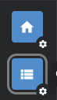

# Prepare Your Environment

!!! note

    If you have already setup k3d, task.dev and other tooling in one of our other projects then
    you can skip this document.

!!! note
    
    If you already have some of the tools listed in the instructions below or feel like using alternatives
    then feel free to skip to the next section, not everythig that is listed is mandatory.

### Tilt

Tilt is a tool that makes it easy to develop on a kubernetes environment with the following benefits:

- Iterate on charts with hot reloading
- Backend and Frontend live reloading
- Debug code from your ide
- Work in an environment that simulates where your software will be running in production
- Easily monitor all your logs and perform custom actions from a ui such as resetting your database

You can read the Tilt documentation [here](https://tilt.dev/)

In order to work on kubernetes you will need to run a few commands, for this you will have followed the instructions
in the [Setup Environment](gs_setup.md) documentation.

#### Step 1

Run `task k3d:install` followed by `k3d:create` this will install the [k3d](https://k3d.io/v5.6.3/) cli and bring up
a kubernetes cluster.

!!! note

    You can later run `task k3d:stop` to stop the cluster and `task k3d:start` to bring it back up without loosing your 
    state, if you want to rebuild your cluster you can run `task k3d:delete` and then repeat the steps outlined on this
    page to re-create your cluster.

Once the above task is completed you should use [lens](https://k8slens.dev/) or [kubectl](https://kubernetes.io/docs/tasks/tools/) 
in order to first verify your server is up and running before continuing to the next step.

Try running:
```shell
kubectl get nodes

# should output
NAME                 STATUS   ROLES                  AGE     VERSION
k3d-dev-1-agent-0    Ready    <none>                 3h36m   v1.24.13+k3s1
k3d-dev-1-server-0   Ready    control-plane,master   3h36m   v1.24.13+k3s1

kubectl get pods -n kube-system

# should output
NAME                                      READY   STATUS    RESTARTS   AGE
coredns-74448699cf-7d8xb                  1/1     Running   0          3h37m
local-path-provisioner-597bc7dccd-vctm2   1/1     Running   0          3h37m
svclb-traefik-5ddc759c-wjk27              2/2     Running   0          3h37m
svclb-traefik-5ddc759c-mcwts              2/2     Running   0          3h37m
traefik-64b96ccbcd-mcnrm                  1/1     Running   0          3h37m
metrics-server-667586758d-2vv6x           1/1     Running   0          3h37m
```

Alternatively you can install [Lens](https://k8slens.dev/), they provide a free developer licence once you sign up.

When you open Lens you will see an icon at the top left of the app:



Click on the catalogue icon (highlighted) and you should see a list of available servers that you can connect to, find
the one called k3d-dev-1 and click on the little pin to add it to your hot bar. You can now click on that icon to
begin browsing your local server.

#### Step 2

Now that you have a kubernetes cluster running locally and have confirmed that it is healthy it's time to get developing
but first we have to install some dependencies into that cluster.

Run `task k3d:install:charts` to install [dapr](https://docs.dapr.io/), [mongo](https://www.mongodb.com/docs/) 
and [nats](https://docs.nats.io/), this will deploy the helm charts for you, you can later run `task k3d:delete:charts` to 
uninstall them if you wish.

Time to get coding.

Now checkout the [Working With Tilt](tilt_usage.md) page for useful information on how to debug, and information
on how to customize certain aspects of your now running environment.
