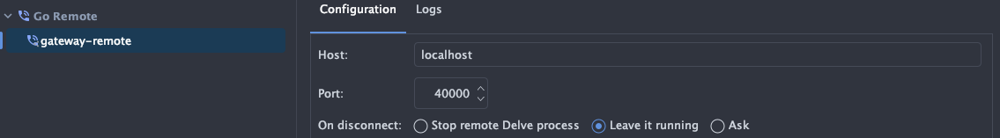

# Working With Tilt

!!! tip

    If `tilt up` returns an error that the port is in use then use `--port <Number>` to set a different port, this can 
    happen if you are running multiple tilt projects at the same time.

While still in the root of the project run `tilt up` a url will be presented on the command line, click on it to
open the Tilt dashboard, here you can view the status of builds and chart deployments. You can click on any of these
to view logs, and you can click on the little restart icon to forcefully refresh each one. 

#### Setting which kubernetes context to use

By default 

#### Switching between HMR and Production mode for Frontend

By default, HMR is enabled when you run `tilt up` if you would like to get a better feel for your bundle sizes
you can edit the `tilt_config.json` file in the root of the project and set `hrm` to false. This will require you
to click on the little refresh icon in the tilt dashboard to do a full reload, now when you edit your front end you
will have to manually refresh your page but your bundles will be smaller.

!!! tip

    If switching does not work after updating this file while tilt is running you can click on the reload icon in
    the tilt dashboard to re-deploy the chart and it should then work. This might take a minuite or two to complete.

    Running in HMR more produces a larger docker image, but once it's pushed updates happen quickly.

#### Setting the correct `GOARCH` for your system

By default, Tilt is building for `arm64` however you can easily change this by editing the `tilt_config.json` in
the root of the project.

* If you are running an Arm cpu
```json
{
  "arch": "arm64"
}
```
* If you are running an X86 cpu
```json
{
  "arch": "amd64"
}
```

#### Debugging the Backend

[Delve](https://github.com/go-delve/delve) is the debugger that is used when you debug in your ide, 
we use the same delve binary within the docker images during development and expose a debug port 
that you can connect to from your IDE in order to debug your code while it runs inside Kubernetes.

This consumes extra memory and cpu and is turned off by default, in order to enable debugging you can edit the
`tilt_config.json` file in the root of the project and add the name of the service to the `debug` list.

```json
{
  "to-debug": [
    "gateway"
  ]
}
```
!!! tip

    If debugging does not work after updating this file while tilt is running you can click on the reload icon in
    the tilt dashboard to re-deploy the chart and it should then work.

All services expose their debug port on `40000` but are mapped to different local ports. The gateway is mapped to port
`40000` locally.

!!! info

    You can change the debug port if it clashes with another project by chaging the relevant port value in the 
    `tilt_config.json`

    ```json
        {
            "gateway-debug-port": "40000",
        }
    ```


